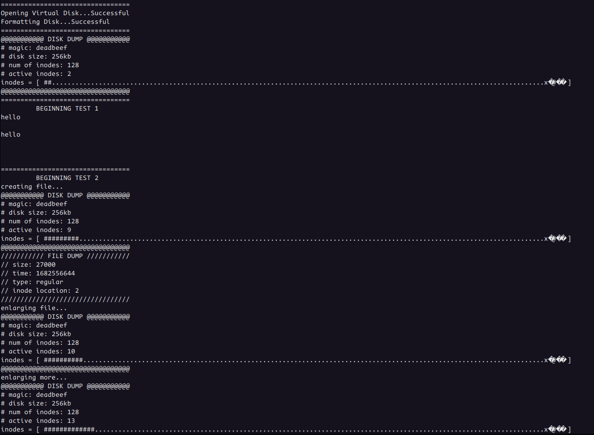

# File System

A simulated file system. Blocks are stored in an in memory array, and written to disk as more space is needed. Free space is represented with bitmap of a length matching that of the simulated disk.

The file system is written in C using the POSIX standard library. Certain system calls are not windows compatible. Large bit shift operations may vary on Architecture and operating system. `main.c` contains unit tests for file system.
